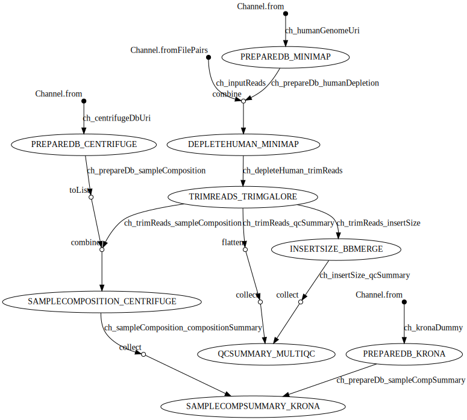

# qc_nextflow
> A nextflow pipeline for inital QC of Illumina sequencing data from bacteria and viruses

It does the following things:
- Depletion of human-derived reads using Minimap2 to map against Hg38 (though in principle, any fasta sequence could be used)
- Sequencing adaptor and quality trimming using trim_galore
- Estimation of sequencing library insert size using bbmerge
- Summary of trimming and insert size metrics with MultiQC
- Classification of reads using Centrifuge (and a database of choice)
- Plotting of Centrifuge reports using Krona

The pipeline is written in Nextflow, a workflow tool to run tasks across multiple compute infrastructures in a scalable way. 
It comes with its own docker container.

### Dependencies
- Nextflow
- One of Docker, conda or singularity

### Usage
You can run it like this:

`nextflow run connor-lab/qc_nextflow --fq '/path/to/input_reads/*_R{1,2}.fastq.gz' -profile {docker, singularity, conda}`

Help and defaults are available:

`nextflow run connor-lab/qc_nextflow --help`

### Pipeline DAG

